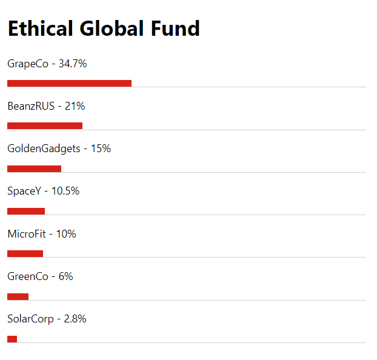

# "Golden Gadgets" - Technical Test

### Preview

<figure>

<figcaption>Preview of the application viewed in the browser</figcaption>
</figure>

### Running the application

Install the dependancies
```
npm i
```
Run the application and view it in the browser at: http://localhost:3000/
```
npm run dev
```
Run the unit tests, results are displayed in the terminal:
```
npm run test
```

-----

## Tool justifications

### Vite & Vitest
I have read about vite and wanted an excuse to try it out. Nothing more to it than that.

Vitest is vite's own testing framework, which in terms of syntax is virtually identical to Jest. Using Jest however would've meant I needed to set up another pipeline in order to run the tests.

### React
A quick an easy way to get content rendered to the page.

### lodash
The useful utility methods like find and deepClone make lodash a natural choice.
